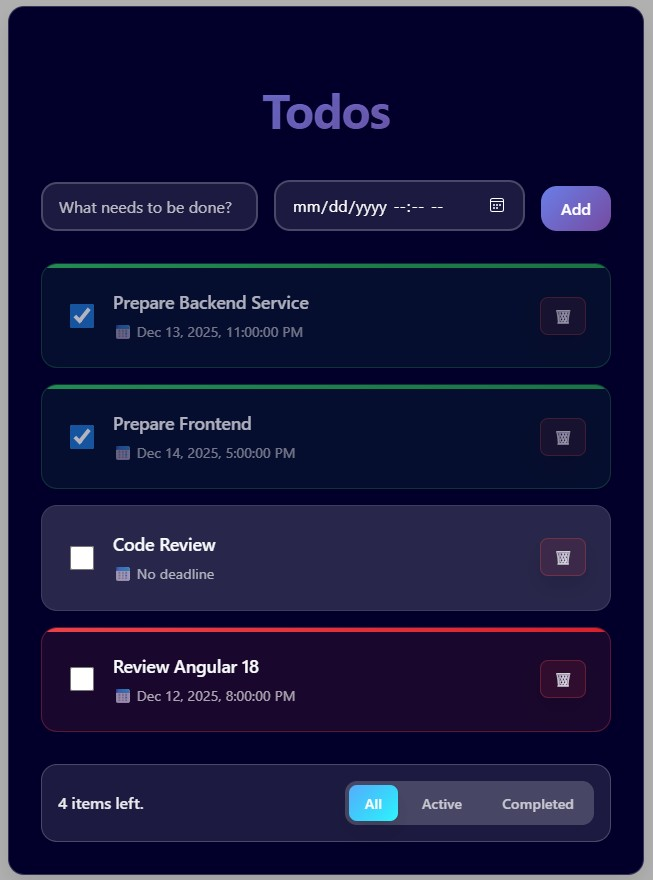

# TickDone Angular

A modern, responsive todo application built with Angular 18. This frontend application allows users to manage their tasks with deadlines, track completion status, and filter todos efficiently.

## Features

- ✅ Add new todos with optional deadlines
- ✅ Mark todos as complete or incomplete
- ✅ Delete todos with confirmation dialog
- ✅ Filter todos by status (All, Active, Completed)
- ✅ Highlight overdue todos
- ✅ Real-time items counter
- ✅ Responsive design
- ✅ Error handling and loading states

## Prerequisites

- Node.js (v18 or higher)
- Angular CLI (v18.2.20)
- A running backend API server at `http://localhost:3000/todos`

## Installation

1. Clone the repository:

   ```bash
   git clone <repository-url>
   cd tickdone-angular
   ```

2. Install dependencies:
   ```bash
   npm install
   ```

## Running the Application

1. Ensure the backend API is running on `http://localhost:3000`

2. Start the development server:

   ```bash
   npm start
   # or
   ng serve
   ```

3. Open your browser and navigate to `http://localhost:4200`

The application will automatically reload if you change any source files.

## API Requirements

The application expects a REST API with the following endpoints:

- `GET /todos` - Retrieve all todos
- `POST /todos` - Create a new todo
- `PUT /todos/:id` - Update a todo
- `DELETE /todos/:id` - Delete a todo

Todo object structure:

```json
{
  "id": number,
  "taskName": string,
  "deadline": string | null,
  "done": boolean
}
```

## Build

To build the project for production:

```bash
npm run build
# or
ng build
```

The build artifacts will be stored in the `dist/` directory.

## Testing

Run unit tests:

```bash
npm test
# or
ng test
```

## Screenshot



## License

This project is licensed under the MIT License.
